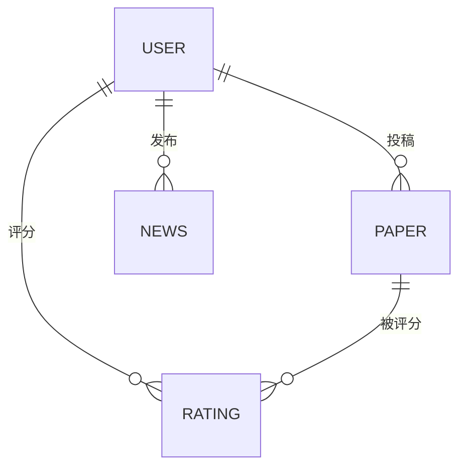

# S.H.I.T Journal

> **S**cholarly **H**ub for **I**ntellectual **T**rash — 一个学术论文 "屎" 评系统

[](https://go.dev)
[](https://go-zero.dev)
[](https://www.mysql.com)
[](LICENSE)

---

## 目录

- [项目简介](#项目简介)
- [系统架构](#系统架构)
- [技术栈](#技术栈)
- [目录结构](#目录结构)
- [微服务拓扑](#微服务拓扑)
- [数据库设计](#数据库设计)
- [API 接口](#api-接口)
- [核心算法](#核心算法)
- [基础设施](#基础设施)
- [快速开始](#快速开始)
- [开发命令](#开发命令)

---

## 项目简介

S.H.I.T Journal 是一个面向学术论文的社区评审平台。用户可以投稿论文、浏览不同学科分区的论文、基于 1-10 分制进行匿名评分，系统根据评分自动计算 **S.H.I.T Score** 并驱动论文在四个 Zone 之间流转（类似 Elasticsearch 的 ILM 生命周期管理）。

**核心特色：**

- 🏗️ **微服务架构** — 4 个 gRPC 服务 + 1 个 HTTP API 网关，基于 go-zero 框架
- 📊 **S.H.I.T Score 算法** — 多维度复合评分：平均分 + 评分数量 + 浏览量 - 争议度
- 🧭 **社区自治闭环** — 评分后实时刷新评分者/作者贡献分，角色每日自动校准
- ⚡ **热数据缓存** — 热门论文 Top 100 缓存 5 分钟，用户贡献分缓存 1 小时，举报 quorum 缓存 10 分钟，论文降级快照缓存 30 分钟
- 📨 **事件队列后处理** — 评分后异步刷新论文分 / 贡献分；举报后异步执行 quorum / 降级计算与缓存失效
- 🏅 **里程碑成就徽章** — 当前支持首次投稿、首篇进入 Sediment、审阅 100 篇，并通过登录 / 用户信息接口返回
- 🔄 **四区生命周期** — Latrine → Septic Tank → Stone → Sediment，定时任务自动晋升/降级
- 🔍 **全文搜索** — MySQL FULLTEXT 索引，支持中英文布尔模式搜索
- 📡 **读写分离** — MySQL GTID 主从复制（1 主 2 从），go-zero 原生 round-robin 读分离

---

## 系统架构

```
                        ┌────────────────────────────┐
                        │       Frontend (TBD)       │
                        └──────────┬─────────────────┘
                                   │ HTTP
                        ┌──────────▼─────────────────┐
                        │    API Gateway  :8888       │
                        │  (journal-api, REST)    │
                        │  JWT 鉴权 · 路由分组         │
                        └──┬──────┬──────┬──────┬────┘
                   gRPC    │      │      │      │    gRPC
              ┌────────────┘      │      │      └────────────┐
              │                   │      │                   │
   ┌──────────▼──────┐ ┌─────────▼────┐ ┌─────▼─────────┐ ┌─▼──────────────┐
   │  User Service   │ │Paper Service │ │Rating Service │ │ News Service   │
   │    :9001        │ │   :9002      │ │    :9003      │ │    :9004       │
   │ 注册/登录/JWT   │ │ 投稿/搜索    │ │ 评分/Score    │ │ 新闻 CRUD      │
   └──────┬──────────┘ └──────┬──────┘ └──────┬───────┘ └──────┬─────────┘
          │                   │               │                │
          └───────────────────┼───────────────┼────────────────┘
                              │               │
                    ┌─────────▼───────────────▼──────────┐
                    │         MySQL 8.0 Cluster          │
                    │  ┌─────────┐ ┌────────┐ ┌────────┐ │
                    │  │ Master  │ │Replica1│ │Replica2│ │
                    │  │ :13306  │ │ :13307 │ │ :13308 │ │
                    │  │  (W+R)  │ │  (R)   │ │  (R)   │ │
                    │  └─────────┘ └────────┘ └────────┘ │
                    └────────────────────────────────────┘

   ┌──────────────┐     ┌───────────────────┐
   │  Redis 7     │     │    Etcd 3.5       │
   │  :16379      │     │    :12379         │
   │  (缓存)      │     │ (服务发现/注册)    │
   └──────────────┘     └───────────────────┘

   ┌──────────────────────────────┐
   │  Lifecycle Cron              │
   │  cmd/lifecycle/main.go       │
   │  每小时执行 Zone 晋升/降级   │
   └──────────────────────────────┘
```

---

## 技术栈

| 层级 | 技术 | 说明 |
|------|------|------|
| **框架** | [go-zero](https://go-zero.dev) v1.10 | 微服务框架，内置服务发现、熔断、监控 |
| **语言** | Go 1.25 | 后端全栈 |
| **通信** | gRPC + Protobuf | 服务间 RPC 通信 |
| **网关** | go-zero REST | HTTP API 网关，自动路由生成 |
| **数据库** | MySQL 8.0 | 主从复制，FULLTEXT 搜索 |
| **缓存 / 队列** | Redis 7 | 热数据缓存（热门论文、贡献分、举报 quorum、论文降级快照）+ 评分/举报后处理事件队列 |
| **注册中心** | Etcd 3.5 | gRPC 服务注册与发现 |
| **认证** | JWT (HS256) | golang-jwt/v4，72h 有效期 |
| **密码** | bcrypt | golang.org/x/crypto |
| **容器化** | Docker Compose | 一键启动全部基础设施 |
| **代码生成** | goctl | Proto → RPC，API → Handler/Logic/Types |

---

## 目录结构

```
journal/
├── ROADMAP.md                       # 技术路线图
├── README.md                        # 本文档
│
├── backend/
│   ├── Makefile                     # 全套构建/运行/生成命令
│   ├── docker-compose.yaml          # 基础设施编排
│   ├── go.mod / go.sum              # Go 模块依赖
│   │
│   ├── api/                         # HTTP API 网关
│   │   ├── journal.api          # go-zero API DSL 定义（20 个接口）
│   │   ├── journal.go           # 网关入口
│   │   ├── etc/
│   │   │   └── journal-api.yaml # 网关配置（端口、JWT、RPC 连接）
│   │   └── internal/
│   │       ├── config/              # 配置结构体
│   │       ├── handler/             # 17 个 HTTP Handler（含 routes.go）
│   │       ├── logic/               # 16 个 Logic（HTTP → gRPC 转发）
│   │       ├── svc/                 # ServiceContext（连接 4 个 RPC Client）
│   │       └── types/               # 请求/响应类型定义
│   │
│   ├── rpc/                         # gRPC 微服务
│   │   ├── user/                    # User Service :9001
│   │   ├── paper/                   # Paper Service :9002
│   │   ├── rating/                  # Rating Service :9003
│   │   └── news/                    # News Service :9004
│   │
│   ├── proto/                       # Protobuf 定义
│   │   ├── user.proto               # 4 个 RPC Method
│   │   ├── paper.proto              # 7 个 RPC Method
│   │   ├── rating.proto             # 3 个 RPC Method
│   │   └── news.proto               # 3 个 RPC Method
│   │
│   ├── model/                       # 数据访问层 (DAO)
│   │   ├── schema.sql               # MySQL DDL（4 张表）
│   │   ├── usermodel.go             # User Model
│   │   ├── papermodel.go            # Paper Model（含生命周期查询）
│   │   ├── ratingmodel.go           # Rating Model（含 S.H.I.T Score 计算）
│   │   └── newsmodel.go             # News Model
│   │
│   ├── common/                      # 公共包
│   │   ├── jwt/jwt.go               # JWT 生成 & 解析
│   │   ├── errorx/errorx.go         # 双语错误码（15 个错误码）
│   │   └── result/result.go         # 统一 JSON 响应封装
│   │
│   ├── cmd/
│   │   └── lifecycle/main.go        # 论文生命周期定时任务
│   │
│   └── deploy/
│       └── mysql/                   # MySQL 主从配置
│           ├── master.cnf           # 主库配置
│           ├── replica1.cnf         # 从库 1 配置
│           ├── replica2.cnf         # 从库 2 配置
│           └── init-replication.sh  # GTID 复制初始化脚本
│
└── frontend/                        # 前端（待开发）
```

---

## 微服务拓扑

### User Service `:9001`

| RPC Method | 说明 |
|------------|------|
| `Register` | 用户注册，bcrypt 哈希存储密码，主库唯一性检查 |
| `Login` | 用户登录，验证密码后签发 JWT（72h 有效期） |
| `GetUserInfo` | 根据 user_id 获取用户信息 |
| `UpdateProfile` | 更新昵称、头像 |

### Paper Service `:9002`

| RPC Method | 说明 |
|------------|------|
| `SubmitPaper` | 投稿论文，自动生成 DOI，初始 Zone 为 `latrine`，并在提交时计算 SimHash 指纹做重复检测 |
| `GetPaper` | 获取论文详情 |
| `ListPapers` | 按 Zone + 学科过滤，支持多种排序 |
| `SearchPapers` | MySQL FULLTEXT 布尔模式全文搜索 |
| `UpdateZone` | 管理员手动更新论文 Zone |
| `UserPapers` | 获取某用户的论文列表 |
| `IncrViewCount` | 异步增加浏览量（+1） |

### Rating Service `:9003`

| RPC Method | 说明 |
|------------|------|
| `RatePaper` | 评分 Upsert（`ON DUPLICATE KEY UPDATE`），防自评，实时重算 S.H.I.T Score |
| `GetPaperRatings` | 获取某论文的所有评分（分页） |
| `GetUserRatings` | 获取某用户的所有评分记录 |

### News Service `:9004`

| RPC Method | 说明 |
|------------|------|
| `CreateNews` | 创建新闻（管理员），支持置顶 |
| `ListNews` | 新闻列表，置顶优先排序 |
| `GetNews` | 获取新闻详情 |

---

## 数据库设计

共 **4 张表**，均使用 InnoDB 引擎、utf8mb4 字符集。

### user 表

```sql
user (
  id              BIGINT UNSIGNED PK AUTO_INCREMENT
  username        VARCHAR(64)     UNIQUE NOT NULL
  email           VARCHAR(128)    UNIQUE NOT NULL
  password_hash   VARCHAR(256)    NOT NULL
  nickname        VARCHAR(64)     DEFAULT ''
  avatar          VARCHAR(512)    DEFAULT ''
  role            TINYINT         DEFAULT 0    -- 0=member, 1=scooper, 2=editor, 3=admin
  contribution_score DECIMAL(10,2) DEFAULT 0.00
  status          TINYINT         DEFAULT 1    -- 0=banned, 1=active
  created_at      TIMESTAMP
  updated_at      TIMESTAMP
)
```

### paper 表

```sql
paper (
  id                BIGINT UNSIGNED PK AUTO_INCREMENT
  title             VARCHAR(512)    NOT NULL
  title_en          VARCHAR(512)
  abstract          TEXT            NOT NULL
  abstract_en       TEXT
  content           LONGTEXT        NOT NULL
  author_id         BIGINT UNSIGNED NOT NULL
  author_name       VARCHAR(64)     NOT NULL
  discipline        VARCHAR(32)     DEFAULT 'other'    -- science/humanities/information/technology/other
  zone              VARCHAR(32)     DEFAULT 'latrine'  -- latrine/septic_tank/stone/sediment
  shit_score        DECIMAL(10,4)   DEFAULT 0.0000
  avg_rating        DECIMAL(5,2)    DEFAULT 0.00
  rating_count      INT             DEFAULT 0
  view_count        INT             DEFAULT 0
  controversy_index DECIMAL(5,4)    DEFAULT 0.0000     -- 评分标准差
  doi               VARCHAR(128)
  keywords          VARCHAR(512)
  file_path         VARCHAR(512)
  status            TINYINT         DEFAULT 1           -- 0=deleted, 1=active, 2=flagged
  promoted_at       TIMESTAMP NULL
  created_at        TIMESTAMP
  updated_at        TIMESTAMP
  -- 索引：FULLTEXT(title, abstract, keywords), zone, discipline, author_id, shit_score, created_at
)
```

### rating 表

```sql
rating (
  id         BIGINT UNSIGNED PK AUTO_INCREMENT
  paper_id   BIGINT UNSIGNED NOT NULL
  user_id    BIGINT UNSIGNED NOT NULL
  score      TINYINT         NOT NULL      -- 1-10
  comment    TEXT
  source_ip  VARCHAR(64)     DEFAULT ''
  user_agent VARCHAR(512)    DEFAULT ''
  device_fingerprint CHAR(64) DEFAULT ''
  created_at TIMESTAMP
  updated_at TIMESTAMP
  UNIQUE (paper_id, user_id)               -- 每人每篇论文仅一次评分
)
```

### news 表

```sql
news (
  id         BIGINT UNSIGNED PK AUTO_INCREMENT
  title      VARCHAR(256)    NOT NULL
  title_en   VARCHAR(256)
  content    LONGTEXT        NOT NULL
  content_en LONGTEXT
  author_id  BIGINT UNSIGNED NOT NULL
  category   VARCHAR(32)     DEFAULT 'announcement'  -- announcement/governance/maintenance/feature
  is_pinned  TINYINT         DEFAULT 0
  status     TINYINT         DEFAULT 1    -- 0=draft, 1=published
  created_at TIMESTAMP
  updated_at TIMESTAMP
)
```

### ER 关系



---

## API 接口

**Public API Base URL:** `http://localhost:8888/api/v1`  
**Admin API Base URL:** `http://localhost:8889/api/v1/admin`

### 公开接口（无需认证）

| Method | Path | 说明 |
|--------|------|------|
| `POST` | `/user/register` | 用户注册 |
| `POST` | `/user/login` | 用户登录，返回 JWT |
| `GET` | `/papers` | 论文列表（支持 zone/discipline/sort 过滤） |
| `GET` | `/papers/:id` | 论文详情 |
| `GET` | `/papers/:id/flag-status` | 论文举报状态 |
| `GET` | `/papers/search` | 全文搜索 |
| `GET` | `/ratings/:id/flag-status` | 评分举报状态 |
| `GET` | `/news` | 新闻列表 |
| `GET` | `/news/:id` | 新闻详情 |

### 认证接口（需要 JWT）

| Method | Path | 说明 |
|--------|------|------|
| `GET` | `/user/info` | 当前用户信息 |
| `PUT` | `/user/profile` | 更新个人资料 |
| `GET` | `/user/papers` | 当前用户的论文 |
| `GET` | `/user/ratings` | 当前用户的评分记录 |
| `POST` | `/papers/submit` | 投稿论文 |
| `POST` | `/papers/:id/flag` | 举报论文 |
| `POST` | `/papers/:id/rate` | 给论文评分 |
| `GET` | `/papers/:id/ratings` | 获取论文评分列表 |
| `POST` | `/ratings/:id/flag` | 举报评分 |

### 管理员接口（JWT + Admin 权限）

| Method | Path | 说明 |
|--------|------|------|
| `GET` | `/keyword-rules` | 查看关键词黑名单规则 |
| `POST` | `/keyword-rules` | 创建关键词黑名单规则 |
| `DELETE` | `/keyword-rules/:id` | 删除关键词黑名单规则 |
| `POST` | `/news` | 创建新闻 |
| `PUT` | `/papers/:id/zone` | 手动调整论文 Zone |

### 内容治理

- 论文投稿与新闻发布都会经过关键词黑名单检查
- 黑名单规则持久化在 MySQL，并通过 Redis + 进程内缓存热更新
- 支持三种匹配方式：`keyword`、`regex`、`pinyin`
- `pinyin` 规则只接受 ASCII 拼音模式，例如 `xueshuzuobi`
- 管理黑名单需要 `admin.keyword.manage` 权限，且管理员贡献分 `contribution_score >= 200`
- 论文投稿会计算 `simhash`，与已有论文做 Hamming Distance 比对
- 距离 `<= 3` 的投稿会自动标记为 `status=flagged`，并生成系统级 `plagiarism` 举报记录
- 评分提交后会做实时异常检测：`10` 分钟内 `>= 8` 次评分触发用户侧 burst 举报
- 论文评分分布的 `bimodality coefficient > 0.55` 时，会自动生成论文侧 `manipulation` 举报记录
- 评分请求会写回 `source_ip` / `user_agent` / `device_fingerprint`
- 同一论文在 `24h` 内若出现同 IP `>= 3` 个不同用户评分，或同设备指纹 `>= 2` 个不同用户评分，会自动生成论文侧 `manipulation` 举报记录

### 响应格式

```json
{
  "code": 0,
  "message": "success",
  "data": { ... }
}
```

---

## 核心算法

### S.H.I.T Score 计算

论文的综合评分由四个维度加权计算：

```
S.H.I.T Score = 0.40 × norm_avg
              + 0.25 × log(rating_count)
              + 0.15 × log(view_count)
              - 0.20 × controversy
```

| 维度 | 权重 | 说明 |
|------|------|------|
| `norm_avg` | 40% | 归一化平均评分 (avg_rating / 10) |
| `log(rating_count)` | 25% | 评分数量的对数，衡量参与度 |
| `log(view_count)` | 15% | 浏览量的对数，衡量关注度 |
| `controversy` | -20% | 评分标准差 (STDDEV)，争议度越高扣分越多 |

### 四区生命周期

论文从投稿开始位于 `latrine` 区（最低区），随评分和浏览量增长自动向更高区晋升。定时任务每小时运行一次：

```
Latrine → Septic Tank → Stone → Sediment
  (新)       (观察)       (优质)    (经典)
```

| 晋升条件 | Latrine → Septic Tank | Septic Tank → Stone | Stone → Sediment |
|----------|----------------------|--------------------|--------------------|
| 最低评分数 | ≥ 3 | ≥ 10 | ≥ 25 |
| 最低 Score | ≥ 0.30 | ≥ 0.50 | ≥ 0.70 |

**降级机制**：超过一定时间无活跃 且 Score 低于阈值的论文会被降级到前一个 Zone。

---

## 基础设施

### Docker Compose 服务

```yaml
# 一键启动所有基础设施
docker-compose up -d
```

| 服务 | 容器名 | 端口映射 | 说明 |
|------|--------|---------|------|
| MySQL Master | journal-mysql-master | 13306 → 3306 | 读写主库 |
| MySQL Replica1 | journal-mysql-replica1 | 13307 → 3306 | 只读从库 |
| MySQL Replica2 | journal-mysql-replica2 | 13308 → 3306 | 只读从库 |
| Redis | journal-redis | 16379 → 6379 | 缓存服务 |
| Etcd | journal-etcd | 12379 → 2379 | 服务注册中心 |

### MySQL 主从架构

- **复制模式**：GTID-based 主从复制
- **读写策略**：go-zero `sqlx.SqlConf` + `Replicas` 配置，写入走 Master，查询 round-robin 分发到 Replica
- **一致性保障**：注册等写后读场景使用 `sqlx.WithReadPrimary(ctx)` 强制读主库
- **初始化**：运行 `make init-repl` 执行 `deploy/mysql/init-replication.sh` 配置复制关系

### 服务注册发现

- 所有 RPC 服务启动时自动向 Etcd 注册
- API 网关通过 Etcd 的 Key（如 `user.rpc`、`paper.rpc`）动态发现后端服务
- 支持多实例水平扩展，自动负载均衡

---

## 快速开始

### 前置要求

- Go 1.25+
- Docker & Docker Compose
- goctl（go-zero 代码生成工具）

### 启动步骤

```bash
# 1. 克隆项目
git clone <repo-url> && cd journal/backend

# 2. 一键启动全部基础设施与服务（推荐）
./start.sh dev

# 3. 生产模式启动（先编译再启动）
./start.sh prod
```

`./start.sh dev` 会按依赖顺序完成：

- Docker 基础设施启动（MySQL 主从、Redis、Etcd、Jaeger、Prometheus、Grafana）
- MySQL 主从初始化
- 业务服务启动并做端口健康检查
- 异常退出自动拉起

当前默认启动的服务包括：

- `user-rpc` `:9001`
- `paper-rpc` `:9002`
- `rating-rpc` `:9003`
- `news-rpc` `:9004`
- `admin-rpc` `:9005`
- `api` `:8888`
- `admin-api` `:8889`
- `cron`（统一定时任务，无固定端口）

如果你仍然需要手动分步启动，也可以：

```bash
make env-up
make init-repl
make tidy
make user-rpc
make paper-rpc
make rating-rpc
make news-rpc
make admin-rpc
make api
make admin-api
make cron
```

### 验证服务

```bash
# 注册用户
curl -X POST http://localhost:8888/api/v1/user/register \
  -H "Content-Type: application/json" \
  -d '{"username":"testuser","email":"test@shit.org","password":"123456"}'

# 登录
curl -X POST http://localhost:8888/api/v1/user/login \
  -H "Content-Type: application/json" \
  -d '{"username":"testuser","password":"123456"}'

# 查看论文列表
curl http://localhost:8888/api/v1/papers

# 全文搜索
curl "http://localhost:8888/api/v1/papers/search?query=量子计算"

# 管理端健康检查
curl http://localhost:8889/healthz
```

---

## 开发命令

```bash
# === 构建 ===
make build              # 构建所有二进制到 bin/
make build-api          # 仅构建 API 网关
make build-admin-api    # 仅构建 Admin API
make build-user         # 仅构建 User RPC
make build-admin-rpc    # 仅构建 Admin RPC
make build-cron         # 仅构建统一定时任务

# === 一键启动 ===
make start              # 等价于 ./start.sh dev
./start.sh dev          # 开发模式一键启动
./start.sh prod         # 生产模式一键启动

# === Proto 代码生成 ===
make proto-all          # 重新生成所有 RPC 代码
make proto-user         # 仅重新生成 User RPC

# === API 代码生成 ===
make api-gen            # 根据 .api 文件重新生成 Handler/Logic/Types

# === 基础设施 ===
make env-up             # 启动 Docker Compose
make env-down           # 停止 Docker Compose
make init-repl          # 初始化 MySQL GTID 主从复制
```

---

## 错误码

| 码值 | 常量 | 说明 |
|------|------|------|
| `0` | OK | 成功 |
| `10001` | ErrInternal | 内部错误 |
| `10002` | ErrInvalidParam | 参数错误 |
| `10003` | ErrUnauthorized | 未授权 |
| `10004` | ErrForbidden | 权限不足 |
| `10005` | ErrNotFound | 资源不存在 |
| `10006` | ErrDuplicate | 重复操作 |
| `20001` | ErrUserNotFound | 用户不存在 |
| `20002` | ErrPasswordWrong | 密码错误 |
| `20003` | ErrUsernameTaken | 用户名已占用 |
| `20004` | ErrEmailTaken | 邮箱已占用 |
| `20005` | ErrUserBanned | 用户已封禁 |
| `30001` | ErrPaperNotFound | 论文不存在 |
| `30002` | ErrInvalidDiscipline | 无效学科 |
| `30003` | ErrInvalidZone | 无效分区 |
| `40001` | ErrAlreadyRated | 已评分 |
| `40002` | ErrSelfRating | 不能自评 |
| `40003` | ErrInvalidScore | 评分无效 |

---

> 📖 更多技术演进方向请参阅 [ROADMAP.md](ROADMAP.md)
